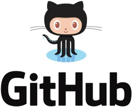

# 2. Setup
데이터과학 전반적으로 여러 가지 환경 설정 하는 것이 필요하며, 대회 참가시에는 더군다나 빨리 데이터를 분석해 인사이트를 뽑아내고 모델을 구축하는 것이 중요하므로 어떤 컴퓨터에서나 빠르게 본인의 환경 구축을 하는 것이 상당히 중요합니다. 그래서 2장에서는 데이터과학 대회 참여를 위한 환경 설정에 대해 알아보겠습니다. Github 설정 방법, 파이썬 환경 설정 방법, 그리고 터미널 사용 방법을 배워보겠습니다. 

```{note}
터미널 사용에는 호불호가 존재합니다. 허나 터미널 사용시 워크플로를 빠르게 해준다는 장점이 있기 때문에 이번 챕터에서 같이 소개해 볼 예정입니다. 
```

## 2.1 Github 소개


- 그림 2.1 Github 로고

Github은 전 세계적으로 가장 많이 사용되는 코드 버전 관리 및 코드 협업 웹 플랫폼입니다. 4천만 명이 넘는 유저를 보유하고 있고, 1억개 이상의 코드 리포지토리를 보유하고 있습니다. 1억개가 넘는 코드 리포지토리 중에 약 2천 8백만개가 오픈 소스로 공개가 되어 있습니다. 그렇기 때문에 누구나 Github 웹사이트에 가면 2천 8백만개 이상의 프로그램들에 대한 코드를 다운로드 받아서 사용할 수 있습니다. 그만큼 전 세계적으로 가장 크고 많은 유저들이 사용하는 공개 코드 버전 관리 및 협업 웹 플랫폼입니다 

2018년에는 마이크로소프트가 무려 75억 달러, 한화로는 약 8조원 정도가 넘는 돈으로 Github을 인수했습니다. Github은 오픈 소스 플랫폼이므로 수익이 많이 나는 회사는 아니었지만 마이크로소프트는 4천만 명이 넘는 개발자와 1억개 이상의 코드 리포지토리에 8조 원이 넘는 가치를 부여한 것이라고 볼 수 있습니다. 그만큼 Github은 대단한 임팩트를 가진 회사입니다. 

그래서 아직 Github을 사용 안해보셨다면 이번 기회를 통해 사용법을 습득해보시길 바랍니다. 데이터과학 대회 뿐만 아니라 모든 프로젝트의 코드를 Github을 통해 관리한다면, 커리어와 학업에도 큰 도움이 될 것입니다. 

### 2.1.1 Github 용어
이번 절에서는 Github에서 사용하는 용어들에 대해 배워보겠습니다. 가장 먼저 배울 용어는 **Git**입니다. Git은 코드 버전 관리 프로그램의 한 종류입니다. 예전에는 [Subversion](https://ko.wikipedia.org/wiki/%EC%84%9C%EB%B8%8C%EB%B2%84%EC%A0%84)과 [CVS](https://ko.wikipedia.org/wiki/CVS)등의 다른 종류의 버전 관리 프로그램들도 사용했으나 지금은 Git이 가장 널리 사용되는 프로그램입니다. 

여러 사람이 팀으로 협업을 할 때 코드 관리가 상당히 어려울 수 있습니다. 예를 들어 팀 리포트를 작성할 때 `A조_리포트_Final.docx`라고 저장하고 다음 사람이 수정을 하면 `A조_리포트_Final2.docx` 또는 `A조_리포트_Final_Final.docx`과 같은 방식으로 파일명을 수정해가면서 작업하신 경험이 있으실거라고 생각됩니다. 소프트웨어나 코드 작성시 이렇게 한다면 관리가 안되기 때문에 **Git**과 같은 버전 관리 프로그램을 사용하는게 일반적입니다. 다른 기업이나 단체에서도 Github 플랫폼을 쓰지 않더라도 **Git**은 사용하는 경우가 대부분이기 때문에 반드시 짚고 넘어가야할 프로그램입니다. 

그 다음 용어는 **리포지토리**(repository)입니다. 이것은 코드 저장소를 뜻합니다. 그리고 **브랜치**(branch)는 각각 다른 코드 버전의 이름을 나타내는 용어입니다. 그리고 마스터/메인(master/main)은 가장 기본이 되는 디폴트 브랜치 이름을 뜻합니다. 과거에는 마스터라고 불렸는데, Github에서는 최근에 메인으로 이름을 변경했습니다. Github외에 다른 환경에 가면 마스터라고도 칭하기도 합니다. 

**커밋**(commit)은 코드를 수정 후, 수정본을 제출하는 과정을 칭합니다. 커밋한 코드를 다른 사람에게 검토를 신청하는 과정을 **Pull Request** 또는 줄여서 **PR**이라고 부릅니다. Pull Request한 코드 변경 사항이 검토자로 부터 승인이 난 후 메인 브랜치에 반영을 하는 과정을 **머지**(merge)라고 합니다. 

앞서 언급한 7개의 용어만 아셔도 Github에서 코드를 관리하고 공유하는데 큰 어려움은 없을 겁니다. 이외에도 세부적으로 들어가면 더 많은 용어가 있는데, 직접 Github을 사용하시면서 하나씩 알아가는 것을 권장드립니다. 2.1.2절 부터 2.1.6절까지는 새로운 리포를 생성하고 코드 변경사항을 커밋하고, PR을 보내고, PR이 승인 난 후 머지하는 과정을 설명드릴 예정입니다. 책을 통해 전체 과정을 숙지한 후에 직접 실습해보시길 권장드립니다. 

### 2.1.2 새 리포지토리 생성
먼저 새로운 리포지토리를 생성하는 과정을 알아보겠습니다. Github에 로그인 하시면 우상단에 `+`모양의 버튼이 있습니다. 해당 버튼을 누른 뒤 `New Repository`버튼을 누르면 그림 2.X와 같은 화면이 나옵니다. 그리고 나서 가장 먼저 리포지토리 이름을 입력해줍니다. 본 예시에서는 `hello-world`라고 입력했습니다. 

그리고 나서 리포지토리가 어떤 리포지토리인지 설명하는 내용을 `Description`란에 적으면 됩니다. 그 후 해당 리포지토리를 공개(Public)할 것인지 비공개(Private)할 것인지 여부를 정해주면 됩니다. 

공개/비공개 여부를 선정한 후에는 `README`라는 텍스트 파일을 생성할 지 여부를 결정해줍니다. 마찬가지로 `.gitignore`파일과 `license`파일을 생성할 지 여부도 결정 한 후 녹색 `Create repository`버튼을 누르면 새로운 리포지토리가 생성됩니다. 

```{admonition} README, .gitignore, license 파일이란?
:class: note
README - 
.gitignore - 
license - 
```

### 2.1.3 새 브랜치 생성
새롭게 생성한 리포지토리에 들어가보면 그림 2.X에 나와 있듯이 `branch: master`라는 버튼이 있습니다. 해당 버튼을 클릭하면 새로운 브랜치 명을 입력할 수 있는 창이 뜹니다. 브랜치 명을 `readme-edits`라고 입력하고 `Create branch`버튼을 클릭하면 새로운 브랜치가 생성됩니다.

일반적으로 코드를 수정할 때는 마스터/메인 브랜치에서 작업하지 않고, 새로운 브랜치를 만든 후에 해당 브랜치에서 코드를 변경하고 커밋 후 PR을 통해 검토를 받은 후, 승인이 났을 때 변경사항을 마스터/메인 브랜치로 머지하는 과정을 거치게 됩니다. 이렇게 하는 이유는 여러 명이서 같은 코드를 동시에 수정할 시에 충돌이 발생할 수 있기 때문에, 충돌을 방지하기 위해서 위와 같은 방법을 사용합니다. 

### 2.1.4 코드 변경 후 커밋
앞서 생성한 `readme-edits`라는 브랜치에서 `README.md`파일을 수정해보고, 수정사항을 커밋해보겠습니다. 텍스트 파일 같은 경우에는 Github 웹사이트에서 직접 수정할 수 있습니다. `README.md`파일을 선택 후 우측 상단에 있는 연필 아이콘을 클릭하면 텍스트 파일을 직접 웹상에서 수정할 수 있습니다. 수정을 한 후에는 어떤 변경 사항을 반영했는지 메시지를 남길 수 있습니다. 마지막으로 `Commit changes`라고 되어 있는 녹색 버튼을 클릭 하시면 변경 사항이 해당 브랜치에 커밋됩니다. 

### 2.1.5 Pull Request 제출
앞서 제출한 커밋에 대한 코드 리뷰를 받기 위해선 Pull Request를 생성해야 합니다. 리포지토리 상단에 있는 `Pull requests` 탭을 클릭 후 `New pull request`라는 녹색 버튼을 클릭해서 새로운 PR을 생성할 수 있습니다. 

`New pull request`를 선택하면 어떤 브랜치로 PR을 생성할 지 선택할 수가 있습니다. 2.1.3절에서 생성한 `readme-edits`라는 브랜치를 선택하면, 어느 파일의 어느 부분이 변경 됐는지 확인할 수 있습니다. 그리고 나서 `Create pull request` 버튼을 클릭하면 PR이 생성됩니다. 

### 2.1.6 Pull Request 머지(merge)
PR이 생성 되면 리뷰어(검토자)를 선정할 수 있습니다. 혼자서 개인 프로젝트를 진행중이라면 PR 생성후 머지를 할 때 리뷰어 선정이 필요 없습니다. 하지만 팀으로 협업을 할 시에는 내가 작성한 코드에 대한 리뷰를 다른 팀원에게 신청할 수 있습니다. PR 페이지 우측 상단에 리뷰어를 선택할 수 있는 옵션이 있으며, 다른 팀 멤버로 리뷰어를 선정하면 해당 리뷰어가 코드를 검토하고 승인할 수 있습니다. 승인하는 과정을 Approval이라고 하며, 승인을 하게 되면 PR을 메인 브랜치로 머지할 수 있게 됩니다. 

머지를 할 때에는 그림 2.X에 나와 있는 `Merge pull request`라는 녹색 버튼을 눌러주면 됩니다. 버튼을 클릭하면 머지할 것인지 최종 확인을 한번 더 하게 됩니다. `Confirm merge`라는 버튼이 뜨는데, 해당 버튼을 누르면 PR이 메인 브랜치로 반영됩니다. 

메인 브랜치로 반영 후에는 변경사항을 반영하기 위해 생성해둔 브랜치는 더이상 필요없기 때문에 `Delete branch`버튼을 클릭해서 기존에 생성해둔 브랜치를 삭제하고 메인 브랜치만 유지하고 관리하는 것을 권장드립니다. 

지금까지 다룬 내용을 정리하자면 메인 브랜치가 존재하고, 메인 브랜치의 코드는 직접 수정하는 것이 아니고 새로운 브랜치를 통해서 수정을 해줍니다. 새로운 브랜치를 생성해서 변경하고자 하는 파일들을 변경하고, 변경사항을 커밋한 후, 제출된 변경사항을 PR을 통해 검토하고, 이상이 없으면은 메인 브랜치로 머지합니다. 변경사항이 메인 브랜치에 반영된 후에는 새로 생성해둔 브랜치를 삭제함으로써 전체 코드 변경 과정이 완료됩니다. 

위 과정을 직접 실습해보는 것을 권장드립니다. 

```{tip}
코드 변경 사항을 여러 줄 쌓아두는 것 보다는, 한 줄을 수정하더라도 새로운 브랜치를 생성해서, PR 생성 후 머지하는 것을 권장드립니다. 해당 과정이 번거롭다고 해서 여러 줄을 모았다가 한번에 PR하고 머지하면, 코드 검토 시 오류 사항을 탐지하기 어렵기 때문입니다. 
```

```{note}
Github은 웹사이트에서도 작업할 수 있지만 Github 데스크톱 프로그램을 다운로드 받으셔서 로컬 컴퓨터에서 작업하시는 것도 가능합니다. 또한 숙련된 분들 같은 경우 터미널 창에서도 모든 작업이 가능합니다. 
```

## 2.2 Python 환경 설정
다음으로는 파이썬 환경 설정에 대해 배워보겠습니다. 

### 2.2.1 Python 설치
파이썬 설치를 할 때 권장드리는 방법은 [Anaconda](https://www.anaconda.com/products/individual) 또는 Anaconda의 미니 버전인 [Miniconda](https://docs.conda.io/en/latest/miniconda.html)라는 파이썬 배포판을 사용해 설치를 하는 것입니다. 파이썬 배포판을 활용해 설치를 하면 가상환경 구축이 쉽고, 각종 머신러닝 라이브러리를 설치하는 것도 쉽고, Jupyter Notebook/Lab과 같은 IDE도 포함되어 있기 때문에 파이썬으로 데이터과학을 하기가 편리합니다. 또한 Miniconda는 관리자 권한 없이도 설치가 가능합니다. 그러므로 학교/회사 서버 같이 본인이 관리자 권한이 없는 경우에도 Miniconda를 사용하면은 관리자 권한이 없어도 설치가 가능합니다. 

```{note}
아나콘다 설치 가이드
- 영문/공식 홈페이지: https://docs.anaconda.com/anaconda/install/
-  한글/윈도우즈: https://gracefulprograming.tistory.com/124
```
### 2.2.2 Anaconda/Conda 실행

| 운영체제 | Anaconda Navigator(입문자용) | Conda(숙련자용) |
|-----|-----|:--------|
|윈도우즈|시작메뉴에서 Anaconda Navigator 선택|시작메뉴에서 Anaconda Prompt 선택|
|맥OS|Spotlight 검색창에서 Navigator 검색|터미널에서 conda 명령어 선택|
|리눅스/윈도우즈 WSL||터미널에서 conda 명령어 선택|
- 표 2.1 Anaconda Navigator와 Conda 비교표

표 2.1은 Anaconda를 실행하는 방법을 정리한 표입니다. Anaconda를 실행하는 방법은 두 가지가 있습니다. 첫번째 방법은 Anaconda Navigator 프로그램을 이용해서 실행할 수도 있고, 두번째 방법은 Conda 터미널 프로그램을 활용해 실행하는 것입니다. 

입문자분들께는 GUI가 구축되어 있어 마우스 클릭으로 손쉽게 상호작용할 수 있는 Anaconda Navigator를 사용하는 것을 추천드립니다. 윈도우즈에서는 시작메뉴, 또는 검색창에 Anaconda Navigator를 검색해서 실행 시킬 수 있습니다. 맥OS에서는 Spotlight 검색창에서 Navigator를 검색해서 실행시킬 수 있습니다. 

윈도우즈에서 Conda를 사용하고자 하시면 시작메뉴에서 Anaconda Prompt를 선택해서 실행시킬 수 있으며, 맥OS/리눅스/윈도우즈 WSL에서는 터미널에서 conda 명령어를 통해 실행시킬 수 있습니다.

### 2.2.3 파이썬 가상환경 생성/실행

파이썬으로 데이터 분석을 하거나 개발할 때는 가상환경 사용을 권장드립니다. 가상환경 없이 파이썬으로 새로운 라이브러리나 프로그램을 설치하거나 삭제하게 되면 운영체제에 있는 프로그램에 직접적인 영향을 줄 수 있습니다. 반면 가상환경을 구축한 뒤에 해당 환경내에서 프로그램을 설치하거나 삭제하면 운영체제에 있는 프로그램에 영향을 주지 않습니다. 그러므로 가상환경 사용을 추천드립니다. 

파이썬에는 파이썬2와 파이썬3이 존재합니다. 2020년 기준으로 제가 추천드리는 파이썬 버전은 3.7 또는 3.8 버전입니다. 3.9가 최신이긴 하지만 아직까지 데이터과학 프로그램들과 완벽하게 호환되지 않습니다. 그래서 최신 버전보다 한단계 낮은 3.7이나 3.8을 추천드립니다. 

Anaconda Navigator에서 가상환경을 생성하기 위해선 `Create new environment` 메뉴를 클릭 후 가상환경 이름을 입력과 파이썬 버전을 선택을 완료한 후에 `Create` 초록색 버튼을 누르면 생성됩니다. 터미널에서는 `conda create -n [가상환경 이름] python=[파이썬 버전]`을 입력하면 새로운 가상환경이 생성됩니다. 예를 들어 아래 코드를 입력하면 파이썬 3.7 버전이 설치되어 있는 `py37`이라는 가상환경이 생성됩니다. 

```
conda create -n py37 python=3.7
```
터미널에서 가상환경을 실행시키기 위해서는 `conda activate [가상환경 이름]` 명령어를 사용하면 됩니다. 아래 코드는 위에서 생성한 `py37` 가상환경을 실행시키는 코드입니다. 

```
conda activate py37
```

### 2.2.4 Jupyter Notebook 실행

가상환경 실행 후에는 해당 환경 위에서 파이썬 프로그램을 실행하고 개발을 해야 합니다. 파이썬으로 코딩을 할 때 많이 사용하는 도구 중 하나인 Jupyter Notebook을 실행하기 위해선 Anaconda Navigator에서는 메인 화면에 선택할 수 있는 여러 프로그램 중 하나로 제공이 됩니다. 그러므로 Jupyter Notebook 아이콘 하단에 있는 `Launch` 버튼을 누르면 해당 가상환경에서 Jupyter Notebook을 실행할 수 있습니다. Anaconda Navigator에서 주의할 점은 Jupyter Notebook을 실행하기 전에 상단에 있는 선택창에서 실행하고자 하는 가상환경을 먼저 선택을 해주셔야 합니다. 기본 값으로 `base`라는 이름의 가상환경으로 설정이 되어 있습니다. 해당 값을 원하는 가상환경으로 변경 후 Jupyter Notebook을 실행하시길 권장드립니다. 

터미널에서는 가상환경을 `conda activate [가상환경 이름]`으로 실행시킨 후 `jupyter notebook` 명령어를 통해 Jupyter Notebook을 실행시킬 수 있습니다. 

### 2.2.5 VS Code / Vim

파이썬으로 개발을 할 때 추천드리는 코드 에디터는 VS Code와 Vim입니다. VS Code는 마이크로소프트에서 나온 오픈 소스 에디터이며 입문자나 전문가 모두에게 추천드립니다. VS Code나 나오기 전에는 Sublime, PyCharm과 같은 에디터를 활용했는데 VS Code가 출시된 후에는 대부분 VS Code를 활용하는 쪽으로 추세가 변했습니다. 윈도우즈/맥OS/리눅스 모두에서 사용가능하며 무료입니다. 

터미널 사용에 자신 있으신 분들께는 Vim을 추천드립니다. 터미널 상에서 개발을 하게 되면 개발 속도가 빨라지기 때문에 여러가지 장점이 있습니다. 단점은 터미널에서 사용하는 프로그램을 배우는데 시간이 많이 소요되는 것입니다. 하지만 한번 익숙해지면 개발 속도가 훨씬 더 향상되는 장점이 있습니다. 

### 2.2.6 캐글 노트북

네 이제 그 지금까지 말씀드린 내용은 로컬 컴퓨터 아니면은 그 자기가 의 그 사용 가능한 학교 컴퓨터나 아니면 꽤나 컴퓨터 이런 상황에서 그 컴퓨터에 직접 파이썬 개발환경 을 설정을 하는 그 방식을 소개를 해드렸는데요 만약에 이제 그 이런 로컬 컴퓨터에서 그 환경 설정을 하고 개발을 한 할 여건이 좀 안 된다 아니면은 그 내가 지금 그 내 컴퓨터가 다른데 있고 온라인에 접속해서 뭔가 개발을 하고 싶다 라고 하면 두 가지 옵션이 있는데 크게 하나면 캐 글 그 컴퓨트 션 웹사 에 케익을 딱 컴에 가시면 은 핵을 노트북을 사용하실수가 있어요 이제 이 팩을 노트북 메뉴에 가셔서 뉴 노트북을 클릭 하시면은 어 간단한 파이썬 개발을 이 팩을 노트북을 이용해서 하실수가 있고 또 다른 방법은 구글 콜렉터블 이용해서 이제 온라인으로 파이썬 개발을 하실 수 있어요 이제 구불 콜레 븐 구글에서 제공하는 그 오픈 소스 그 주피터 노트북 환경 인데 이 구글의 그 척도 구글 콜렉트 빼 접속을 하시면 은 이제 기본적으로 그 여러 가지 예제 들도 제공을 하고 즉 그 길어 파고 연동을 시킬 수도 있고 자기의 개인 구글 차입 하고도 연금을 연동을 시킬 수가 있어요 그래서 코드를 먹이 럽에서 더 가져온다 든지 아니면 파일을 구글드라이브 해서 가져온다 든지 이런 그 여러가지 유용한 그 풀을 제공하기 때문에 구글 콜레 블 사용하시는 것도 한가지 방법이라고 예 할 수 있습니다 그래서 개인 컴퓨터나 아니면 학교 컴퓨터에는 앞서 말씀드린 것처럼 아나콘다 를 이용해서 환경 설정을 하시고 이제 그 온라인으로 그 개발을 하시는 경우에는 캐 글 노트북이나 구글 콜레 글 사용하시면 환경 설정이 이미 다음 페이스 그래서 그 거의 모든 훨씬 많이 live in 파이썬 이다 설치가 돼 있기 때문에 온라인으로 비교적 간편하게 그 개발을 하실 수 있습니다 예 어 지금까지 파이썬 환경 설정에 대한 질문 사람이 있으신가요 vf 편집기를 다운받으려고 하면 터미널에서 다운받아 한건가요 음 설치과정이 이제 터빈 그 파일을 다운로드 받으면 그게 5 오코 민어 에서 실행 해외 펌이나 대해서 이제 압축을 풀고 10의 그 실행을 설치를 하고 실행해야 하는 그 과정을 걸치 있구요 그런데 이제 윈도 에도 보면 쥐 vim 이라는 그 제가 이런걸 역의 좋을텐데 쥐에 im 이라는 어그 gui 베이스의 bim 빔 에디터도 있기는 한데 사용하기가 아무래도 그 약간 그 터미널에 있는 빈 만큼 편하진 않아요 이제 터미널에서 빔을 사용하는 가장 큰 이유가 터미널을 떠나지 않고 키보드만으로 모든 개발 을 닿아 완료 하려고 하는건데 이제 gvim 을 사용하면 은 그 윈도우 그 마우스를 사용해서 이제 메뉴를 선택을 하고 하는 과정을 거치 할 때이기 때문에 그러면 굳이 그 지프 아 m 을 사용할 필요가 없이 vs 코드를 사용하면 되죠 근데 그래서 그 터미널에서 이제 빔은 터미널에서 개발 하실 때 그 추천을 드리구요 이제 만약에 그 윈도우나 맥 상에서 마우스를 가지고 그 마우스를 같이 사용해서 개발 하실 때는 굳이 빔을 사용하기보다는 vs 코드를 사용하시는게 더 효율적일 수 있어요 또 다른 질문 사항이 있으신가요 왜 지금 이제 시간이 좀 많이 했는데 터미널은 이 약간 호불호가 그 갈래요 그래서 이제 터미널은 말 터 밀러의 익숙해지면 이제 제가 그칠 허니 좀 h1 돼 있기 때문에 제가 이제 그 유튜브에 올린 데모가 하나인데 oo 구 oo 도시 풀이가 틀니 시 나 요 램프를 들립니다 아 그리고 5 또 아아 2호 등 0순위 대한 소리가 안들려요 아 동영상 소개 안된거 으 여기 이제 제가 유튜브 링크 l 앱팡 이 노트에 이제 그 추가를 했는데 거기에 가시면 제가 터미널을 이용해서 이렇게 어떤 그 팩을 컴퓨팅 # 데이터 셋을 다운로드 받고 개발하고 요 를 제출하는 과정을 전부 다 이제 터미널에서 하는 그 이제 예제를 이렇게 데모로 만든 영상이 자 이제 이걸 보시면 은 이제 그 형태가 만든 때 본데 터미널 사용하면 아무래도 그 마우스를 사용하기 하지 않기 때문에 훨씬 더 빨리 할 수가 그 개발 과정이 훨씬 훨씬 빠르다는 장점도 있고 뿌 약간 뭐 요즘 뭐라고 하죠 플렉스 라쿤 플렉시 라고 하네요 약간 가 우가 산다 어서 개발자 보수가 어 가호가 탄다 이런 그 이제 그 그런 약간 뭐 그 실질적 잉꼬 외에 어떤 장점도 있구요 그래서 이제 저같은 경우는 파미 널 개발을 선언을 했는데 그래서 만약에 터미널에 대해서 내가 알아 보고 싶다 이제 그런 분들은 3가 여기에 그 이번 강의 암에 이제 터미널에 관련된 내용을 이렇게 그 추가를 했어요 그래서 지금 오늘 시간에 그 시간 안에 다 설명을 드리기는 좀 그 시간이 모자랄 것 같고 그 이강의 안에 끝 제가 소개해드린 내용도 있고 기본적인 또 그 생 자주 사용하는 커맨드 들도 명령어 들도 제가 이렇게 그 이제 공유를 했으니까 한번 이제 관심이 있으신 분들은 그 맥 맥 에서 맥이나 리눅스 센서는 터미널 프로그램이 있죠 그 터미널이 라고 그 이름이 되어 있는 프로그램이 있고 윈도우에서는 제가 추천드리는 것은 윈도우즈 팬 이상에서는 wsl 윈도우즈 섭 리눅스 시스템 이라는 그 옵션을 설정을 하시면 은 윈도우 제안에서 리눅스 프로그램을 사용하실 수가 있어요 그래서 리눅스에서 사용하는 터미널을 사용할 수 있는데 이 방법을 추천을 드리구요 어반 약의 어 그 wsa 윈도우즈 섭 리눅스 시스템을 사용할 수가 없다 아니면은 뭐 좀 번거롭고 8 싶으신 분들은 그 또 인터넷에 보시면 은 윈도우에서 사용할 수 있는 배 시 그 터미널 프로그램이 그 몇 몇 가지 종류가 있어요 그 프로그램 총 프로그램을 다운로드 받으셔서 그 사용하실 수도 있어요 이제 가장 유명한 것은 c 그 윈 이라는 cyan cygwin 이라는 그 탐이 난 프로그램이 가장 유명한데 이제 이 프로그램을 그 사용하시면 윈도우에서도 배쉬 명령어 펫이 터미널을 사용하실수가 있어요 근데 이제 제가 추천드린 안그러면 wsl 을 사용하시면 은 이 눅스 에서 그 사용하는 프로그램을 모두 사용할 수가 있는데 이 씨 루빈 같은 경우에는 약간 팬은 프로그램도 있고 안되는 프로그램도 있고 그래서 이제 추정 드리는 것은 급 wsl 을 사용하시면 또 좋다 라는 말씀을 드리고 싶구요 또 이제 뭐 또 몇 가지 명령을 많이 사용되는 명령어가 켓 하면은 텍스트 파일을 전부 다 춤 그 출력을 하실 수가 있고 헤드 을 사용하시면 앞부분 4일에 앞부분만 출력할 수가 있고 테이를 하면 파일의 마지막 부분만 출력을 할 수 있고 법을 uc 하면은 그 월드 카운트에 약자인데 그 파일이 가지고 있는 모든 문자 수를 출력을 해 줘요 그리고 wc 폐 cl 하면은 그 x 파일에 몇 줄이 몇 개 있는지를 출력을 해 주고 이제 g 을 사용하면 굉장히 빨리 검색을 할 수 있어요 그래서 어떤 다 넣을까 어디에 있는지 검색해 낼 때 이제 그래 명령을 사용하실수가 있어요 그리고 이제 그 터미널에서 가장 많이 사용되는 옷 중 하나가 가장 유용한 것 중 하나가 이 파이프 기능하고 니다 액션 기능인데 파이프는 모를 하는 거냐면 여러가지 프로그램을 연결 해서 실행을 시킬 수가 있죠 그래서 예를 들어서 ls 하면은 그 빨 리스트를 보여주는 몇 명 헌데 이 달 리스트를 보여주는 명령어 거 뒤에 파이프를 그 주고 그 뒤에 이제 검색을 하는 g 명령을 사용해서 이제 ms 이라는 단어를 내가 검색을 하고 싶다 그러면은 빠 1 냉 중에 mse 가 들어있는 파일을 출력을 하게 해 줘 그래서 이제 이 예를 들어서 이런 파일이 그 뭐 컬 달 시스템에 존재한다고 했을 때 ls 파이프 g msc 명령어를 사용하면 은 바로 이제 이 mse 3일이라는 파일만 찾아서 보여주는 거죠 으 이제 이게 또 파이프를 하나만 할 수 있는 게 아니라 여러 개 를 연다 가서 붙일 수가 있어요 그래서 만약에 내가 텍스트 파일을 뭐 전부 달 출력을 한 다음에 그 안에서 그 뭐 ms 이라는 단어가 들어있는 줄만 출력을 하고 그 다음에 그 중에서도 3위 10개만 내가 출력을 한다 그러면 뭐 그 캐 탁 어케 타고 달 이런 그 다음에 그래 파고 mse 그 다음에 헤드 해 cm 뭐 이렇게 하면은 그 일 년에 그 모든 프로그램을 다 실행해서 마지막 결과물만 이제 보여주나 그래서 god's 아주 유용 한 그 기능 중 하나가 이 파이프 기능 이구요 또한 아닌 이다 액션은 그 명령어 들의 각종 명령어 들의 출력을 딸로 저장을 하거나 아니면 다른 프로그램의 입력으로 제공할 수 있게 해주 해주는 기능이에요 그래서 예를 들어서 그 앞서 은 나온 ls 파이프 g ms 이라는 명명 에 결과물은 어떤 파일로 저장을 하고 싶다 그러면은 ls 파이 그래 ms2 뒤에 이 리다이렉션 꺽쇠 의 표시를 하고 파일 이름을 주면 그 내용이 바로 파일로 저장이 되게 됩니다 그래서 1 들어서 2 여기에서는 지금 현재 디렉토리에 있는 모든 파일을 리스트 다 텍스트 라는 파일로 저장을 하는 꼴을 바로 이 리다이렉션 기능을 이용해서 이제 그 수행을 했죠 그래서 ls 리다이렉션 리 씨가 텍스트 라고 한 다음에 켓 리스트 다 텍스트 하면 리스트 다 텍스 안에 있는 내용을 보여 주는데 바로 이제 그 디렉토리에 있는 모든 파일 이름을 이렇게 이제 보여주게 된 것을 확인 할 수 있습니다 4 그리고 이제 또 터미널에서 사용할 수 있는 여러가지 프로그램들이 있는데요 근데 그중에 하나는 이제 킴 웍스 라는 프로그램이 있구요 이 팀웍 쓰는 그 원격으로 그 접속을 할때 그 세션을 유지해 주는 그 기능이 기능을 제공하고 그 다음에 터미널 보면 굉장히 단순하게 한 화면 이잖아요 근데 그 화면 안에서 창을 2날 하거나 이제 그 윈도우를 그 스위치 할 수 있는 그런 기능을 제공해 줍니다 이제 이게 자체가 시간이 별로 없긴 하지만 직접 보여드리는 게 제일 빠를것 같아요 혹시 재 화면 보이시나요 펌이 널 하면 보이시나요 4 러면 입니다 그래 이게 기본 이제 맥에서 제가 사용한건 100 인데 이걸 윈도우 법으로 의 세리나 리눅스에서도 똑같이 사용하실수가 있어요 이게 그 제가 사용하는 기본 그 타 문화를 화면인데 여기에서 팀웍 쓰라고 하고 그 세션 이름을 정이라고 이제 하면은 2 이게 2 그 팀웍 세션의 니 생산이 됐는데 이거 기능이 뭐냐면 제가 이게 4 자 이게 첫 번째 세션 인데 새로운 세션을 이렇게 터미널 안에서 키보 들만 가지고 만들 수가 있어요 그래서 이게 패션 투가 되구요 이 세상 됨 4 스위치를 하는게 역시 키보드로 지금 세션으로 돌아왔죠 그리고 다시 세션의 프로가 고이게 모든 키보다 해서 그 사용이 가능해요 그래서 여러가지 터미널 창을 한 화면에서 이제 사용하실 수 있고 그리고 또 많이 사용하는게 이렇게 화면을 나누거나 화면을 이제 화면을 나눌 때도 그 버티컬 5 나누거나 허리 전 털 로 나누거나 이제 이걸 자유자재로 할 수가 있고 5 이상에서 이제 여러가지 화면 여러가지 프로그램을 동시에 실행에서 한 화면에서 다 볼 수가 있죠 이제 이 프로그램이 걸 가능하게 해주는 프로그램이 바로 팀 어스 라는 프로그램입니다 그리고 또 하나의 장점은 이제 원격으로 그 서버에 ssh 프로그램을 이용해서 접속을 했을 때 가끔 커넥션이 끊기는 경우가 있잖아요 베컴 액션이 끄기 더라도 2팀 어스 를 이용해서 접속을 한 경우에는 그 커넥션이 유지가 되요 그래서 내가 인파 넷이 끊어져서 프로그램이 종료가 됐다고 하더라도 키 막스 로 8시 그 서버에 접속을 하며 내가 사용하던 포 매미 그대로 이제 끊기 지 않고 그대로 그 사용 가능하게 된 게 되어 있는 거죠 그래서 굉장히 그 중요하고 유용한 프로그램입니다 4 색 그러면 다시 그리고 이제 빔의 대해서는 그 말씀을 드렸구요 이제 ssh 는 원격 접속 프로그램 으로 많이 알려져 있는데 그 많은 분들이 모르는 또 그 좋은 기능중 하나 뭐냐면 커 널린 기능이에요 이건 뭐냐 며 내가 원격 서버에 접속을 했는데 원격 서버에서 주피터 노트북을 사용한 다니며 는 무슨 뭐 vs 코드를 사용한다 그러면은 ui 가 필요하잖아요 그 원격 서버의 ui 를 접속을 해야 되는게 그 어떤 경우에는 이제 리모트 텍스 데스크탑 이라는 프로그램을 사용해서 접속을 할 수 있는 서버 들도 있지만 그게 그 가능하지 않은 서버 들 수 있죠 이제 그런 경우에는 그 어떤 방법이 있냐면 이 ssh 프로그램을 이용해서 터널을 뚫을 수가 있어요 그래서 제 컴퓨터에서 서버 로 터널을 뚫고 그 그러면은 그 뭘 할 수가 있냐면 뭐 엄격히 서버에서 주피터 노트북을 시행했을 때 그 화면에 제 컴퓨터에서 이제 접속을 할 수 있게 만들어주는 거죠 이게 그 폴트 똘 딩 이라는 그 기능을 이용해서 가능한 건데 이제 주피터 노트북도 원격으로 사용하실 수가 있고 vs 코드 같은 프로그램도 원격으로 사용하실 수 있어요 그래서 굉장히 유용한 프로그램 y 있구요 그리고 만약에 그 세션의 접속하는 게 아니라 파일만 원격으로 주고 받고 싶다 그러면 scp 라 에는 프로그램을 사용하실 수 있고 그 다음에 이제 서버에서 파일을 전송 받는 게 아니라 웹 사이트에서 파일을 다운로드 않는가 라고 할 때는 w 계시나 그 커리 라는 프로그램을 사용하실 수 있습니다 그리고 이제 텍스트 파일을 처리하는 그 언어 날 프로그램으로는 이제야 억 라는 프로그램이 있는데 이것을 사용하면 은 아 니켈 간단하게 또 보여드리도록 할게요 이제 어 여기에 데이터 있는지 모르겠는데 어 여기 아 아예 여기에 보면은 지금 으 으 매입할 예를 들면 맥스 id 라는 이런 긁다 일이 있을 때 아이 이거는 좋은 예제가 아닌데 어디 여기 cs 파일이 있잖아요 테스 tess 파일 그러면 이제 화면이 작으니까 테스트 하씨 spl 보면은 이렇게 실컨 마로 이제 분류가 되어 있죠 근데 이게 그 칼럼이 몇 개인가 라고 했을 때 간단하게 aw 이렇게 어크 파일을 이용해서 뭐 이렇게 어 하다 아 이제 아빠 이름을 안 졌군요 제가 obd2 제약도 데모를 하려 크 아니타 이게 안 되는데 예 아무튼 그 칼럼 이름을 8 이제 그 터미널 상에서 바로 알수가 있지 이제 팔짱 프로그램에서 판다 에서 머고 들을 해서 알 수도 있지만 4 그 점에 회교 안되지 아 이상하다 예 않듯 예 제가 할 요가 데모를 하려고 하니까 안 되는데 으 그 이제 여러 가지 기능을 그 수행 할 수 있는 게 awk 고 그 다음에 또 이제 세드 같은 경우에는 그 팩터 민어 라인에서 파일을 검색하거나 간단하게 수정을 할 수가 있을까 에서 예를 들면 은 어떤 파일 안에서 뭐 그 ms 일을 전부 다 auc 로그 및 플레이스를 하고 싶다 그거를 터미널 상에서 가능하게 해준 게 바로 이 얘들아 는 프로그램입니다 예 이외에도 굉장히 여러가지 프로그램들이 있는데 이제 그 어퍼 민아 을 같은 경우에는 배우는데 아무래도 시간이 좀 걸릴 때가 있고 그 모르신다 2 이쪽 머리 업계 들리신 다고 하더라도 그 모 참여 뭐 좌절 하시거나 그럴 필요 없이 모든 사람이 처음에 시작할때 다 어려운 건데 하나하나 이제 써 보시다보면 은 점차 그 손에 익숙하게 되고 여러분이 꼭 개발을 한다거나 못 해외 참가 하실 때 그 굉장히 효율을 높여줄 수 있는 그런 방법 입니다 그래서 만약에 도전 해 보시고 싶으신 분들은 한번 도전해 보시기를 이제 추천수 입니다 외국시 터미널에 대한 그 직무상 있을 수 있을까요 제가 이제 시간이 그 몇 분 남지 않았는데 질문 4 없으시면 제가 이제 참고자료로 몇 가지 링크를 공개를 했는데 길어 꿈 치타 이득이 럽 사이트에 있는 공시가 이드와 아나콘다 사이트에 있는 공식 가이드 링크를 으 여기에 슬라이드에 추가를 했고요 그리고 이 믹스 메이크업 6월 crs 에듀케이션 이라는 클래스가 있어요 mit 클래스 인데 유튜브에 다 공개가 있는 클래스 인데 이 클래스에서 뭘 가르쳐 주세요 하면 보통 cs 그 교과목에 빠져 있는 내용들이 바로 이런 컴이 너를 사용 하거나 vim 에디터 를 사용 하거나 아니면 기술을 사용하거나 이런게 사실 빠져 있잖아요 근데 이런 거에 대한 클래스를 그 mit 에서 따로 유튜브로 만들어서 공개를 했어요 그래서 여러분들을 보시면 이 각각 이 클래스의 가시면 제가 간 그 간단하게 설명한 내용들에 대해서 더 깊이 있게 배우실 수가 있을 겁니다 그래서 그 패 시 셰어 터미널 사용하는 방법 그리고 bi 암 에디터 생한 방법 그리고 어크 나 3 을 이용해서 데이터를 뭐 분석하는 방법 그리고 기 차용한 방법 이렇게 파미 너를 사용한 방법에 대한 mik 온라인 클래스가 있으니까 관심있으신 분들은 참고하시길

## 2.2 Python 환경 설정


## 2.3 터미널 소개